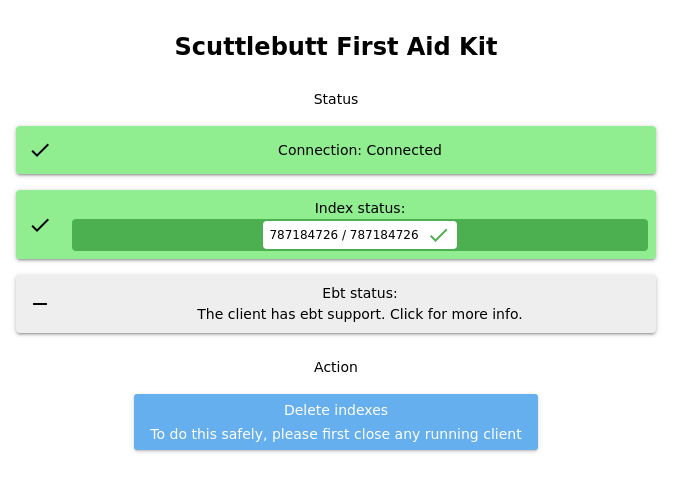

# ssb-first-aid-kit

A user-friendly app for diagnosing and fixing problems with your Scuttlebutt installation



## Features

* See if this app can connect to a running client.
* See the status of your database (flumedb) indexes.
* See the status of other clients replicating you (using ebt)
* A button for deleting your database indexes if they seem stuck or broken.

## Installing and using the app

Download and install [the latest release](https://github.com/ssbc/ssb-first-aid-kit/releases/latest) (`.AppImage` for Linux, `.dmg` for macOS, or `.exe` for Windows).

When running the app, if you're not sure what to do to fix your problem, you can ask people on Scuttlebutt what to do, or if you don't have access to Scuttlebutt, you can ask in the online [irc chat](https://webchat.freenode.net/#scuttlebutt).


## Developing the app

* `git clone` it
* `npm install`
* `npm run dev` launches the app with hot/automatic reloading when you save files. At first it shows a blank screen though, and you need to refresh the page (ctrl+R). You only need to do this once though, after that it should reload automatically.

## Making a release

To make a release commit and tag, do
```
npm version $TYPE
```
where `$TYPE` is either `major`, `minor`, or `patch`. Then push it with
```
git push --tags origin master
```
(the `--tags` is needed otherwise git doesn't push the tag, and `origin master` is needed otherwise it only pushes the tag, not also the commit)

After the automatic builds are done there should be a new draft release on the releases page on GitHub.


## License

This project is [licensed](./LICENSE) under AGPL-3.0